# VulnLab

A hands-on cybersecurity learning platform designed to help learners understand and practice common web application vulnerabilities in a safe lab environment.

## Overview

VulnLab is a full-stack web application that provides interactive vulnerability labs, user progress tracking, leaderboards, profile management, and an administrative control panel.

The project is built as a cybersecurity portfolio platform for learning offensive security concepts while demonstrating secure backend development, authentication, authorization, and user management.

---

## Features

### Authentication System

* User Registration
* User Login
* Separate Admin Login
* JWT Authentication
* Role-Based Access Control
* Admin Authorization
* Login & Registration Rate Limiting
* Password Reset System

### User Features

* Personal Dashboard
* Learning Profile
* Progress Tracking
* XP System
* Rank System
* Leaderboard
* Update Username
* Update Email
* Change Password

### Admin Features

* Admin Dashboard
* User Management
* Create User Accounts
* Create Admin Accounts
* Edit User Information
* Delete Users
* Grant XP
* Reset User Progress
* Reset User Passwords
* Export Users CSV
* Lab Analytics
* Activity Monitoring
* Audit Logs
* User Search
* Lab Monitoring

### Vulnerability Labs

1. SQL Injection
2. Stored XSS
3. IDOR
4. JWT Privilege Escalation
5. Path Traversal
6. CSRF
7. Command Injection
8. SSRF
9. File Upload Vulnerabilities

---

## Technology Stack

### Frontend

* HTML
* CSS
* JavaScript

### Backend

* Node.js
* Express.js

### Database

* PostgreSQL

### Security

* JWT
* bcrypt
* Helmet
* express-rate-limit

---

## Architecture

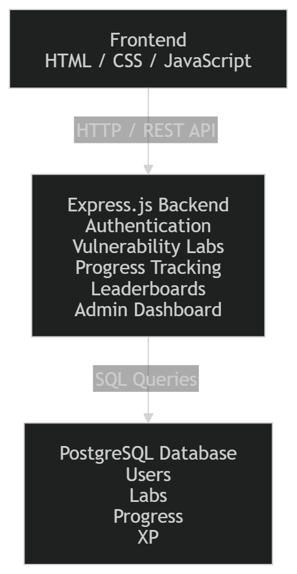

VulnLab follows a three-tier architecture:

* Frontend: HTML, CSS, JavaScript
* Backend: Node.js & Express.js
* Database: PostgreSQL

The frontend communicates with the backend through REST APIs, while the backend interacts with PostgreSQL for authentication, progress tracking, XP management, leaderboard data, vulnerability labs, and administrative operations.


## Screenshots

### Landing Page

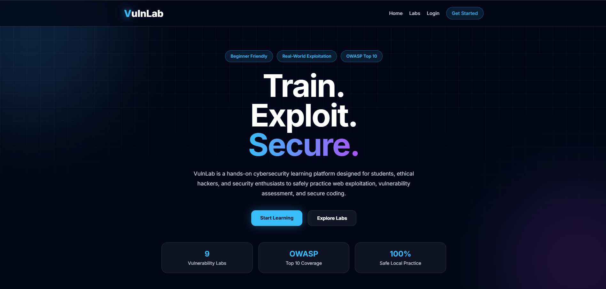

### User Dashboard

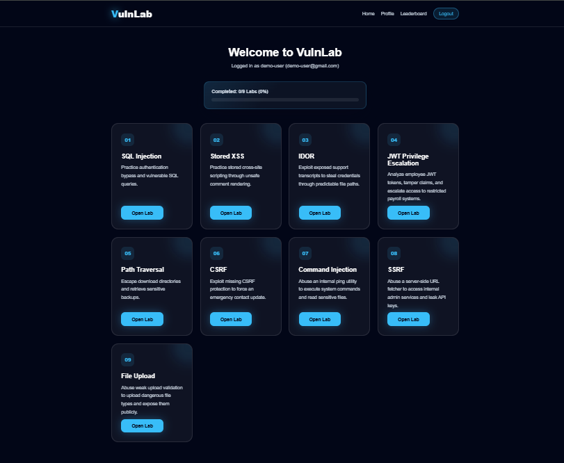

### Profile Management

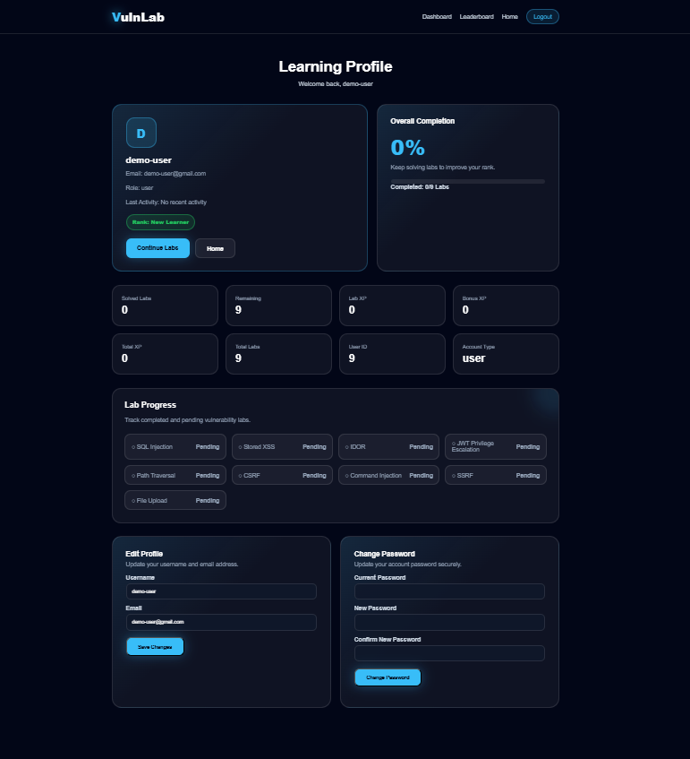

### Leaderboard

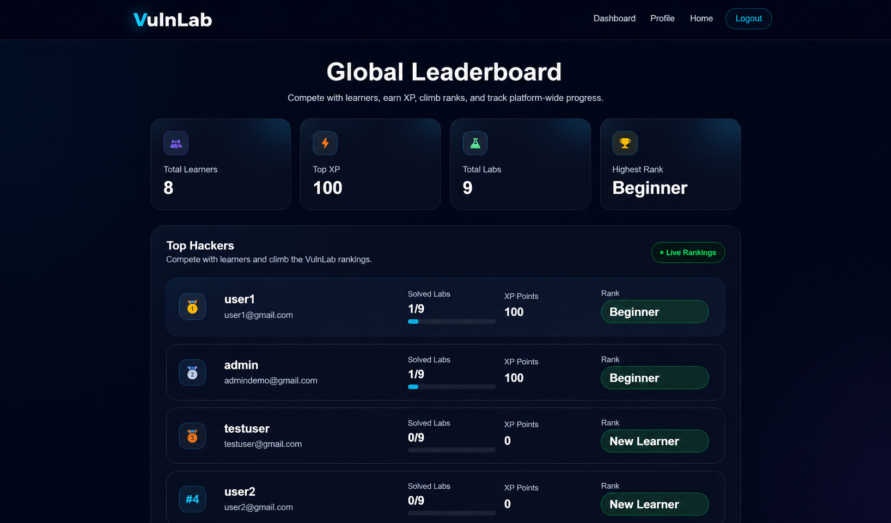

### SQL Injection Lab

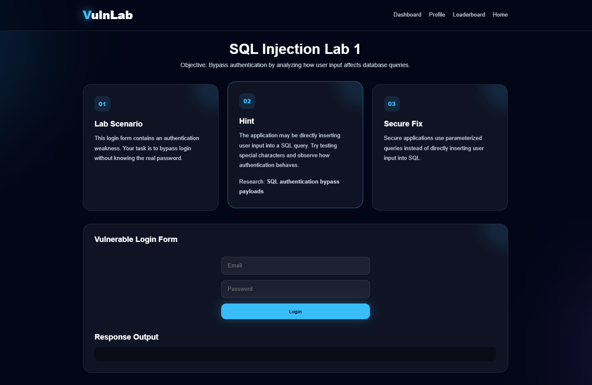

### Stored XSS Lab

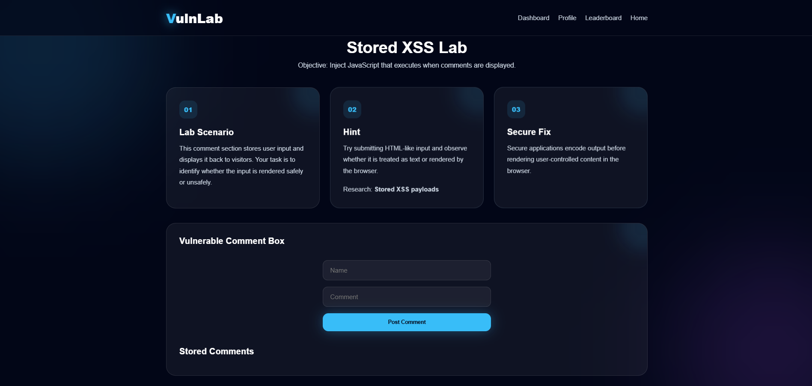

### Admin Dashboard Overview

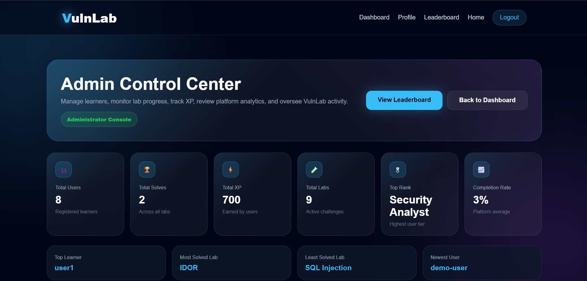

### Admin User Management

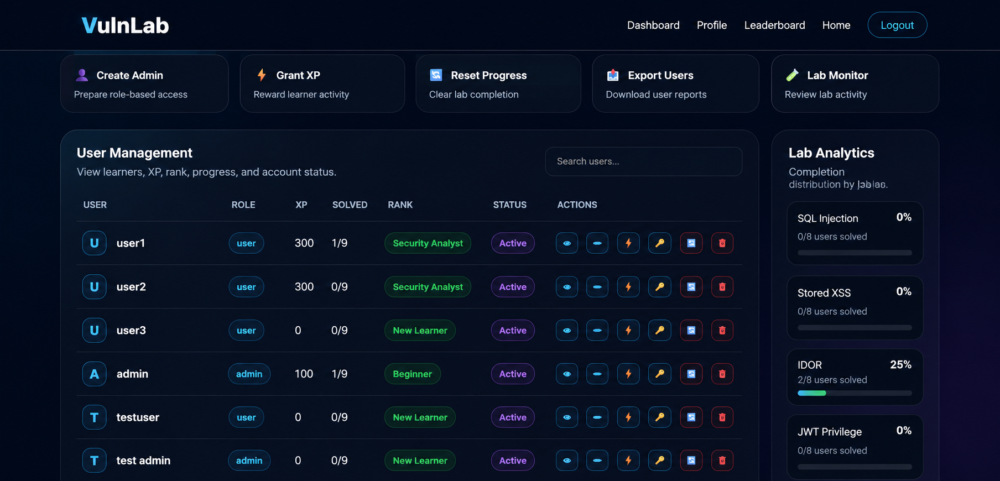

### Admin Lab Monitoring

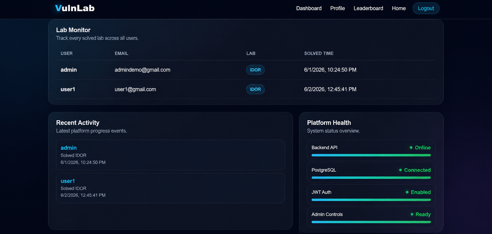

### Admin Audit Logs

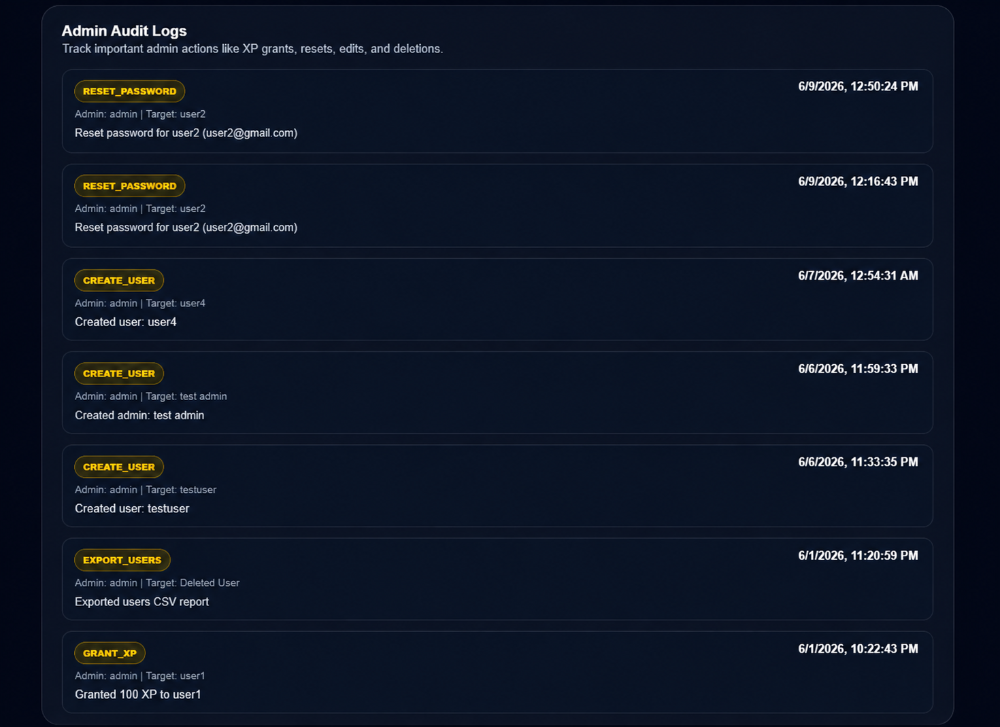


## Project Structure

```text
VulnLab
│
├── backend
│   ├── src
│   │   ├── routes
│   │   ├── middleware
│   │   ├── database
│   │   ├── vulnerabilities
│   │   └── app.js
│   │
│   └── package.json
│
├── frontend
│   ├── css
│   ├── js
│   ├── labs
│   ├── index.html
│   ├── login.html
│   ├── admin-login.html
│   ├── register.html
│   ├── dashboard.html
│   ├── profile.html
│   ├── leaderboard.html
│   └── admin.html
│
├── docs
│   ├── architecture.png
│   └── screenshots
│
├── docker
├── walkthroughs
├── README.md
├── LICENSE
├── .gitignore
└── .env.example
```


---

## Installation

### Clone Repository

```bash
git clone https://github.com/YOUR_USERNAME/VulnLab.git
cd VulnLab
```

### Install Backend Dependencies

```bash
cd backend
npm install
```

### Configure Environment Variables

Create a `.env` file inside the backend directory.

Example:

```env
DB_USER=postgres
DB_HOST=localhost
DB_NAME=vulnlab
DB_PASSWORD=your_password
DB_PORT=5432

JWT_SECRET=your_secret_key
```

### Create Database Tables

A database schema file is included:

```text
backend/src/database/schema.sql
```

Run the schema using PostgreSQL:

```bash
psql -U postgres -d vulnlab -f backend/src/database/schema.sql
```

Or execute the file directly through pgAdmin Query Tool.

### Start Server

```bash
npm run dev
```

Server will run on:

```text
http://localhost:5000
```

---

## Database

The platform uses PostgreSQL for:

* User Accounts
* Authentication
* Progress Tracking
* XP Management
* Leaderboard Data
* Admin Audit Logs

### Main Tables

#### users

Stores user and administrator accounts.

Columns:

* id
* username
* email
* password
* role
* bonus_xp

#### user_progress

Stores solved lab progress.

Columns:

* id
* user_id
* lab_key
* solved
* solved_at

#### admin_logs

Stores administrative actions.

Columns:

* id
* admin_id
* target_user_id
* action
* details
* created_at

### Database Schema

A reusable schema file is included:

```text
backend/src/database/schema.sql
```

This allows the entire database structure to be recreated without requiring a backup file.

---

## Security Features

* Password Hashing with bcrypt
* JWT Authentication
* Protected Routes
* Admin Authorization Middleware
* Role-Based Access Control
* Helmet Security Headers
* Login & Registration Rate Limiting
* Input Validation
* Progress Lab-Key Validation

---

## Authentication Flow

### User Login

Users login through:

```text
frontend/login.html
```

Backend endpoint:

```http
POST /api/auth/login
```

Only accounts with role `user` can access this route.

Successful login redirects users to:

```text
dashboard.html
```

### Admin Login

Admins login through:

```text
frontend/admin-login.html
```

Backend endpoint:

```http
POST /api/auth/admin-login
```

Only accounts with role `admin` can access this route.

Successful login redirects administrators to:

```text
admin.html
```

---

## Admin Capabilities

Administrators can:

* View platform statistics
* Monitor user activity
* Create users
* Create administrators
* Edit user details
* Delete accounts
* Grant bonus XP
* Reset progress
* Reset passwords
* Export CSV reports
* View audit logs
* Monitor lab completion statistics

---

## Learning Purpose

This project is intended for:

* Cybersecurity Students
* Ethical Hacking Learners
* Web Security Practice
* Portfolio Demonstration
* Security Awareness Training

---

## Current Status

VulnLab currently supports:

* 9 Vulnerability Labs
* User Authentication
* Admin Authentication
* Progress Tracking
* XP System
* Leaderboard
* Profile Management
* Admin Dashboard
* Audit Logging
* Password Reset
* CSV Export
* Analytics

The project is suitable for:

* Local Cybersecurity Learning
* Portfolio Demonstrations
* Academic Projects
* HR and Technical Interviews
* Security Awareness Training

---

## Production Safety Warning

VulnLab contains intentionally vulnerable labs including:

* SQL Injection
* Stored XSS
* IDOR
* Path Traversal
* CSRF
* Command Injection
* SSRF
* Unrestricted File Upload

The project is intended for local learning, cybersecurity training, and portfolio demonstration only.

Do not deploy VulnLab directly to the public internet without:

* Lab Isolation
* Containerization
* Secure Secret Management
* Automated Testing
* Production Monitoring
* Token Revocation
* Database Migrations
* Security Hardening

---

## Future Improvements

* Docker Support
* Automated Testing
* Email Verification
* Forgot Password via Email
* Multi-Factor Authentication (MFA)
* Session Revocation
* Database Migration System
* Lab Isolation
* Server-Side Lab Completion Verification
* CI/CD Pipeline
* Production Deployment Configuration
* Health Monitoring
* Dependency Vulnerability Scanning

---

## Author

**Albin K Anish**

Advanced Diploma in Information Security (ADIS)

Offenso Hackers Academy

Cybersecurity Enthusiast | Ethical Hacking | Web Security

---

## Demo Data Notice

Any usernames, email addresses, passwords, JWT secrets, API keys, tokens, or credentials displayed within VulnLab are intentionally fictional and exist solely for educational purposes.

No production credentials, real user information, or sensitive secrets are included in this repository.


## Disclaimer

VulnLab is developed for educational and training purposes only.

All vulnerability simulations are intentionally included for learning purposes and should only be executed within a controlled lab environment.

The author is not responsible for misuse of the techniques demonstrated within this project.
